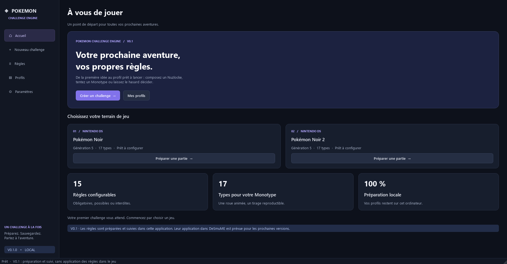

# Pokemon Challenge Engine — V0.1

Application Windows en français pour préparer des challenges **Pokémon Noir** et
**Pokémon Noir 2**, enregistrer des profils et lancer DeSmuME standalone.

**La V0.1 ne modifie pas la ROM, n'écrit pas dans la mémoire du jeu et n'impose aucune
règle dans Pokémon.** Le suivi est manuel. Le mode STRICT est une intention enregistrée
pour les versions suivantes. La règle Randomizer est uniquement prévue et configurable.



[Voir la roue Monotype](docs/screenshots/monotype.png) · [Résultats des contrôles](docs/verification.md)

## Installation sous Windows

Prérequis : Python **3.12 ou plus récent**, avec le lanceur Windows `py`.
Configuration vérifiée : Python 3.13, PySide6 6.11.2, pytest 9.1.1.

Depuis PowerShell, dans le dossier `pokemon-challenge-engine` :

```powershell
py -3.13 -m venv .venv
.\.venv\Scripts\Activate.ps1
python -m pip install -r requirements.txt
python -m app.main
```

Remplacer `-3.13` par une version installée compatible (`py -0p` affiche la liste).
Si l'activation PowerShell est désactivée, les commandes suivantes fonctionnent sans
modifier la politique d'exécution :

```powershell
py -3.13 -m venv .venv
.\.venv\Scripts\python.exe -m pip install -r requirements.txt
.\.venv\Scripts\python.exe -m app.main
```

Dans l'espace de travail livré, un environnement a déjà été préparé dans **le dossier
parent**. Pour le démarrer immédiatement depuis `pokemon-challenge-engine` :

```powershell
..\.venv\Scripts\python.exe -m app.main
```

`Lancer.ps1` détecte l'environnement dans le projet ou son parent et utilise `pythonw.exe`
pour éviter une console Python supplémentaire :

```powershell
.\Lancer.ps1
```

## Utilisation

1. Ouvrir **Nouveau challenge** et choisir Noir ou Noir 2.
2. Choisir un preset ou régler les états : obligatoire, possible, interdite.
3. En mode aléatoire, choisir le total exact de règles et une seed facultative.
4. Pour Monotype, ouvrir la roue, exclure des types si souhaité, tirer puis confirmer.
5. Générer le challenge, lui donner un nom et sauvegarder le profil.
6. Renseigner les chemins dans **Paramètres**, tester, puis lancer DeSmuME.

Le mode personnalisé inclut les obligations et leurs dépendances. Le mode aléatoire
complète le total avec les règles possibles ; une combinaison impossible est expliquée.
La partie normale conserve zéro règle. Chaque modification de réglage invalide l'aperçu.

Les presets Classic Nuzlocke, Hardcore Nuzlocke, Monotype, Chaos et Custom sont des
propositions modifiables, pas des définitions officielles universelles.

Monotype propose 17 types, **sans Fée**, avec trois modes : Souple (au moins un type),
Strict (type principal) et Pur (type unique). Le mode, les exclusions et les relances
sont conservés. Sans roue manuelle, la seed choisit le type à la génération.

Dans **Profils**, consulter le challenge et sa seed, reprendre les réglages pour créer
une copie ou mettre à jour la progression manuelle. Une sauvegarde de challenge crée
toujours un nouveau profil ; la modification du suivi existant demande confirmation.

## RetroBat et DeSmuME

Les chemins sont choisis par l'utilisateur : aucun chemin RetroBat n'est présumé.
Les paramètres enregistrent le dossier ou l'exécutable RetroBat, l'exécutable DeSmuME,
les deux ROM `.nds` et un dossier de sauvegardes facultatif.

La V0.1 lance **directement DeSmuME standalone** avec la ROM configurée, même si cet
émulateur est aussi utilisé depuis RetroBat. Elle ne modifie pas la configuration de
RetroBat et ne le pilote pas. Le champ RetroBat sert de repère local pour l'intégration
future. Le bouton Tester contrôle les chemins, sans démarrer un jeu.

Le chemin des sauvegardes est informatif : aucune sauvegarde n'est redirigée, supprimée,
copiée ou écrasée par cette application. DeSmuME conserve son comportement normal lorsque
vous jouez. Aucun émulateur, jeu, ROM ou asset Pokémon officiel n'est fourni.

## Tests et contrôles

Avec l'environnement du projet :

```powershell
.\.venv\Scripts\python.exe -m pytest -q
.\.venv\Scripts\python.exe -m compileall -q app
```

Avec l'environnement déjà préparé dans le parent :

```powershell
..\.venv\Scripts\python.exe -m pytest -q
..\.venv\Scripts\python.exe -m compileall -q app
```

Les tests couvrent les obligations/interdictions, dépendances, conflits, jeux, seed,
comptage exact, Monotype et position finale de la roue, profils corrompus ou manquants,
configuration, arguments du launcher et intégrité de fichiers sentinelles ROM/sauvegarde.
Le launcher est testé avec processus simulé ; le lancement d'un véritable jeu dépend
des chemins locaux que vous renseignerez.

## Architecture et limites

```text
app/
  main.py       démarrage, thème et logs
  models/       dataclasses et validation
  core/         catalogue, règles, tirages, profils
  services/     chemins et lancement DeSmuME
  ui/           navigation, pages et roue Qt
data/           jeux, règles, types Gen V et presets JSON
profiles/       un dossier par profil
lua/            placeholders documentés pour V0.2
tests/          tests pytest métier, fichiers et interface
docs/           architecture, roadmap et vérification
```

[Architecture détaillée](docs/architecture.md) · [Feuille de route](docs/roadmap.md) ·
[Passerelle Lua prévue](lua/README.md) · [Vérification de la livraison](docs/verification.md)

Les journaux rotatifs sont dans `logs/app.log`. `--debug` active les détails dont la
commande de lancement (les chemins sont alors visibles dans ce journal).
Les profils, la configuration, les logs et les ROM sont exclus de Git.

Le catalogue V0.1 contient 15 règles. Les jeux futurs sont décrits dans les données mais
restent indisponibles. Une forte augmentation du catalogue nécessitera d'adapter la
recherche de combinaisons. La synchronisation DeSmuME, les blocages stricts, le vrai
Randomizer et l'empaquetage PyInstaller ne sont pas implémentés.

La V0.2 dispose déjà d'une séparation métier/UI, de profils versionnés, d'un historique
structuré et de points d'entrée Lua documentés. Aucune adresse mémoire n'a été inventée.

Documentation Qt utilisée : [Qt for Python](https://doc.qt.io/qtforpython-6/),
[QPropertyAnimation](https://doc.qt.io/qtforpython-6/PySide6/QtCore/QPropertyAnimation.html).
